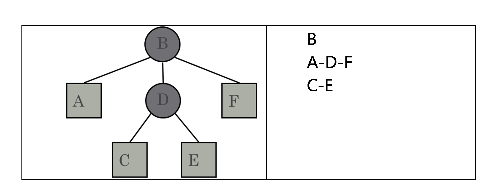

#Lab 2 -Enunciado
## Introdução
Considere que se pretende representar uma estrutura de Bookmarks como  apresentada na Figura 1

Para tal optou-se por usar o ADT Tree disponibilizada no package pt.pa.adts

##Nível Básico (Acompanhamento em Aula ou Autónomo)
 
A classe BookmarkEntry serve para representar pastas assim como bookmarks concretos; no caso de pastas só contém a chave (atributo “key”).

1.	Crie a classe BookmarkManager que será responsável por gerir um conjunto de bookmarks de um browser; 

2.	Adicione uma instância de TreeLinked com nome bookmarks, que será manipulada posteriormente, de forma a que permita guardar um conjunto de elementos do tipo BookmarkEntry. A raíz da àrvore deverá conter inicialmente a pasta “Bookmarks”.

NOTA: Todos os métodos seguintes deverão ser implementados invocando métodos já implementados em TreeLinked (não necessita alterar a implementação).

3.	Crie os seguintes métodos auxiliares (privados):

-	`Position<BookmarkEntry> find(String key)` --- devolve a posição na árvore do elemento com a chave especificada, null caso contrário;
-	`boolean exists(String key)` --- verifica se existe algum elemento com a chave especificada;

4.	Implemente na classe BookmarkManager os seguintes métodos (utilize os métodos auxiliares anteriores para as validações necessárias):
-	`void addBookmarkFolder(String keyParent, String keyFolder) throws BookmarkInvalidOperation` --- recebe a chave da pasta ascendente (keyParent) e da nova (keyFolder), adicionando a última como descendente. Caso a pasta ascendente não exista, lança exceção com mensagem descritiva; caso a chave keyFolder já exista, também lança exceção com mensagem apropriada.
-	`void addBookmarkEntry(String keyParent, String keyEntry, String url) throws BookmarkInvalidOperation` --- analogamente ao método anterior, mas para uma bookmark efetiva.
-	`int getTotalEntries()` --- devolve o número total de entradas (pastas e links);
-	`String getParentFolder(String keyEntry) throws BookmarkInvalidOperation` -devolve a key do Folder ascendente à entrada dada do tipo link. Caso a KeyEntry não seja válida (não existe ou é do tipo folder) lança uma exceção.

5.	Complete o método main na classe Main, de forma a construir uma arvore como é ilustrada na figura 1 (acrescente o folder e os bookmarks marcados a negrito) 

6.	Adicione à interface Tree (e respetiva implementação) o método:

- `void move(Position<E> existingPosition, Position<E> newParent)` --- move (remove e insere) um nó da àrvore para descendente de outro nó.

##Nível Avançado (Autónomo)
Este nível é para quem pretende fazer avançar os seus conhecimentos na matéria, podendo fazer uso dos horários de dúvidas para acompanhamento.

1.	Elabore os testes unitários da implementação TreeLinked.

2.	Acrescente os seguintes métodos à interface Tree, implemente-os e teste-os
-	`public int level(Position<E> position)throws InvalidPositionException` – retorna o nivel a que pertence o nó da posição dada. Caso a posição seja inválida lança uma exceção.

-	`public String printByLevels()`- Imprime a árvore por níveis, colocando um nível por linha.

Exemplo do printByLevels:

Nota: para a implementação da operação printByLevels, sugere-se que parta do algoritmo BFS (Breath First Search)  dada nos slides das aulas TP e modifique-o de modo a quando os nós de um nível já tiverem sido todos processados, mude de linha. 

- `public Collection<Position<E>> inLevel(int level)` - retorna a coleção de Posições que pertencem ao mesmo nível da arvore.
Nota: Use a mesma estratégia que usou para imprimir a árvore por níveis.

